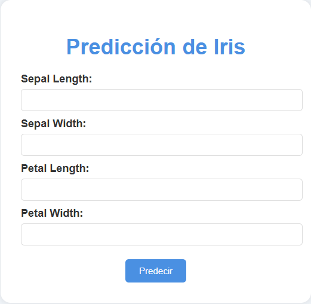

# Predicción de Iris con FastAPI 🌼

Este proyecto utiliza un modelo de Machine Learning entrenado con Scikit-Learn y desplegado con FastAPI. Permite predecir la especie de una planta Iris a partir de características como el largo y ancho de sus sépalos y pétalos.

---

## 📌 Características
- 🌟 Despliegue de modelo Machine Learning con FastAPI.
- 💻 Interfaz web simple y estilizada con HTML y CSS.
- 📊 Modelo de clasificación con Random Forest.
- 📥 Predicción en tiempo real desde un formulario web.

---

## 🚀 Instalación y uso

### Clonar el repositorio
```bash
 git clone https://github.com/TomasZapani/Predicci-n-Iris.git
 cd Predicci-n-Iris
```

### Crear y activar un entorno virtual
```bash
python3 -m venv venv
source venv/bin/activate  # Linux o Mac
.\venv\Scripts\activate   # Windows
```

### Instalar dependencias
```bash
pip install -r requirements.txt
```

### Entrenar el modelo (opcional)
Si deseas entrenar el modelo desde cero:
```bash
python model_training.py
```

### Ejecutar la API
```bash
uvicorn main:app --reload
```

Abre tu navegador y ve a:
```
http://127.0.0.1:8000/
```

---

## 🌼 Vista de la Interfaz


---

## 📦 Dependencias
- FastAPI
- Uvicorn
- Scikit-Learn
- Jinja2

---

## 📌 Comandos principales para GitHub

### Añadir cambios al repositorio
```bash
 git add .
 git commit -m "Descripción de tus cambios"
 git push -u origin main  # O master si usas esa rama
```

---

## 📌 Créditos
Creado por [TomasZapani](https://github.com/TomasZapani) ✨
